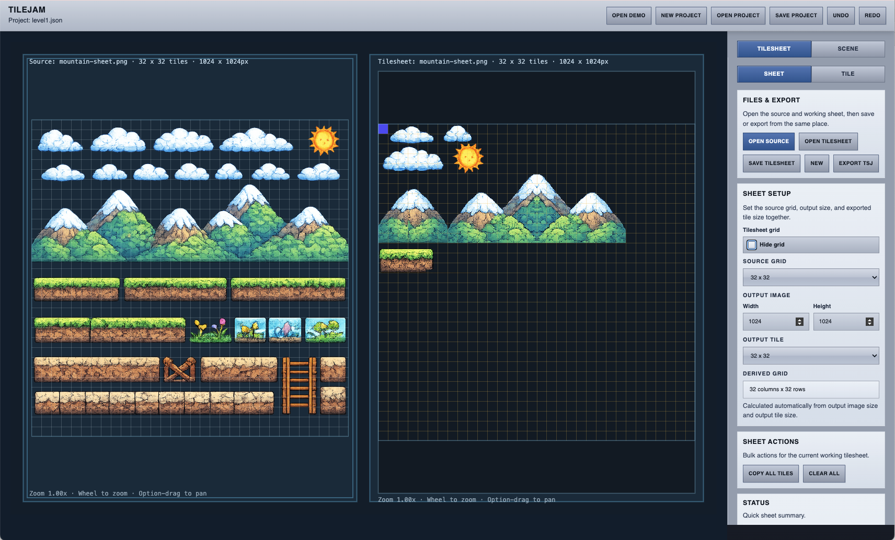
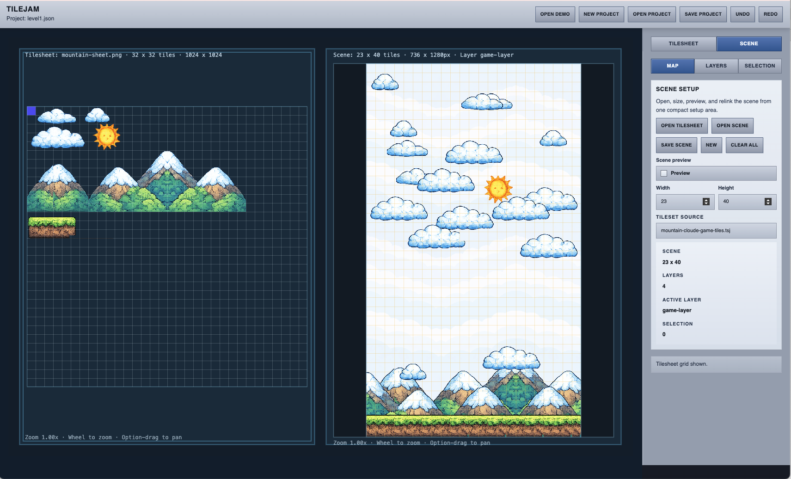

<div align="center">

# Tilejam

Tilejam is a compact browser-based tile and scene editor for turning rough or AI-generated tilesheets into clean, grid-aligned game assets.

<p>
  <a href="https://genxbit.github.io/tilejam/" target="_blank" rel="noreferrer">
    
  </a>
</p>

<p><sub>Live app on GitHub Pages</sub></p>

<p>
  
  
  
  
</p>

</div>

> This project was developed with Codex.
>
> Steering docs:

* [docs/ONBOARDING.md](docs/ONBOARDING.md): start a new Codex session
* [docs/PRODUCT.md](docs/PRODUCT.md): product intent, workflow, and scope
* [docs/TECH_WORKFLOW.md](docs/TECH_WORKFLOW.md): architecture, ticket structure, and prompt template
* [docs/FORMATS.md](docs/FORMATS.md): project, export, and file format rules
* [docs/ITERATIONS.md](docs/ITERATIONS.md): roadmap and current tickets

<p align="center">

</p>

<p align="center">

</p>

## What It Does

**Tilesheet editor**

* load a source image or working tilesheet
* place source regions into an editable output tilesheet
* crop, repair, transform, and export PNG / TSJ

**Scene editor**

* use the current tilesheet as the scene palette
* place and edit tiles across layers
* support TMJ scene files and image layers

## Browser

Tilejam runs in the browser, but it is designed for desktop-style local file workflows.

Chrome or Edge is the preferred browser because Tilejam relies on the File System Access API for the best open/save experience and there is no backend server. Other browsers can still run the app, but some project and file flows are more limited.

## Run Locally

Requirements:

* Node.js 20+
* npm

```bash
npm install
npm run dev
```

Open the local URL printed by Vite, usually [http://localhost:5174](http://localhost:5174).

## Production Build

```bash
npm run build
npm run preview
```

For a Pages-like local test, you can also serve `frontend/dist` with a static server after `npm run build`.

## GitHub Pages

Tilejam runs on GitHub Pages as a static site.

Use the hosted app for:

* `Open Demo` to try the bundled example setup
* local source / tilesheet / scene / project files from your own machine
* local exports and saves back to your own disk

For the best hosted file workflow, use Chrome or Edge.

> GitHub Pages serves the app, but your project files, scene files, and exports still stay on your own disk.

## Controls

Use the toolbar `Help` button in the app for the same shortcuts and mouse controls.

**Mouse**

* source panel: drag to select source tiles
* tilesheet / scene: click to select one cell
* tilesheet / scene: drag to build a rectangular selection
* tilesheet / scene: `Cmd-drag` on Mac or `Ctrl-drag` on PC to move the selected group
* source / output: wheel to zoom
* source / output: `Option-drag` on Mac, `Alt-drag` on PC, or middle-mouse drag to pan

**Keyboard**

* copy: `Cmd+C` on Mac, `Ctrl+C` on PC
* paste: `Cmd+V` on Mac, `Ctrl+V` on PC
* undo: `Cmd+Z` on Mac, `Ctrl+Z` on PC
* redo: `Shift+Cmd+Z` on Mac, `Ctrl+Y` or `Shift+Ctrl+Z` on PC
* delete selection: `Delete` or `Backspace`
* move selected tiles or scene cells: `Shift+Arrow keys`
* pan hovered view: `Option+Arrow keys` on Mac, `Alt+Arrow keys` on PC
* reset hovered view: `0`

## Preferred Project Folder Structure

A compact folder layout like [docs/examples](docs/examples) works best for linked project files:

```text
your-project/
  level1.json
  level1.tmj
  level1.tsj
  source-textures/
    mountain-sheet.png
  textures/
    mountain-sheet.png
    clouds-bg.png
```

Use the project JSON, scene file, tileset files, and related source/image assets in the same project folder tree so Tilejam can resolve linked files correctly.

## Creating Source Sheets With ChatGPT

You can generate input source sheets in ChatGPT and then clean them up in Tilejam.

These source sheets are often useful but not perfectly aligned. Tilejam helps crop, place, adjust, and repair them into a clean working tilesheet.

Prompt template:

```text
Create a 1024x1024 pixel art tileset in a 32x32 grid (32x32px tiles).

Style: polished cartoon pixel art with soft shading, subtle gradients, rounded forms, and vibrant colors, similar to modern mobile games.

Theme: [INSERT THEME]

Requirements:
- Tiles strictly aligned to grid, no overlap between tiles
- Uniform removable background (transparent-style or flat color)
- Group similar assets per horizontal row (no mixed categories)
- Terrain/background rows must tile seamlessly horizontally
- Consistent lighting, scale, and color harmony across all tiles
```

<details>
<summary>Why Tilejam helps after generation</summary>

AI-generated source sheets are often close, but not clean enough to use directly. Tilejam is there to crop, align, place, repair seams, and rebuild a usable working tilesheet.

</details>

## Codex Workflow

Typical feature workflow:

1. discuss the feature and desired behavior with Codex
2. ask Codex to create a ticket in [docs/ITERATIONS.md](docs/ITERATIONS.md) using the ticket structure from [docs/TECH_WORKFLOW.md](docs/TECH_WORKFLOW.md)
3. ask Codex to implement that ticket
4. ask Codex to validate architecture and design against `TECH_WORKFLOW.md`

Use the `Codex Prompt Template` in [docs/TECH_WORKFLOW.md](docs/TECH_WORKFLOW.md) when you want a compact implementation prompt.

Common Codex tasks:

* create or update the next ticket in `docs/ITERATIONS.md`
* implement a specific ticket from `docs/ITERATIONS.md`
* validate architecture against `docs/TECH_WORKFLOW.md`
* validate UX/design against the same rules
* review UX, grouping, and editor layout before coding
* update product, workflow, format, or iteration docs when rules change
* check browser and static-host behavior for Chrome, Edge, Safari, and GitHub Pages

## Start A New Codex Session

Use [docs/ONBOARDING.md](docs/ONBOARDING.md) to initialize a new session.

Suggested start:

1. ask Codex to use `docs/ONBOARDING.md`
2. review the current ticket and steering docs
3. discuss the next change
4. create or refine the next ticket before implementation
